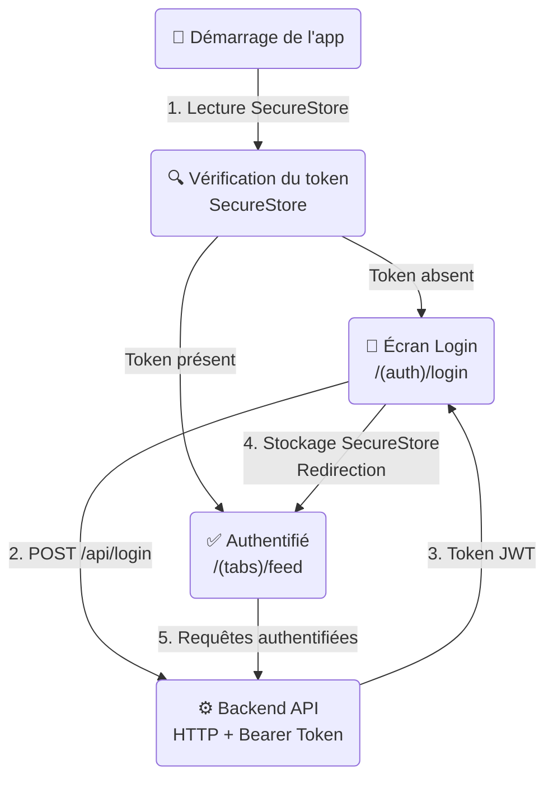

# 📱 Health-IA-Mobile - Application Mobile HealthAI Coach

**Application mobile** de la plateforme HealthAI Coach, construite avec **React Native**, **Expo 56** et **TypeScript**. Cette application permet aux utilisateurs de suivre leur santé, leurs exercices et leur alimentation depuis leur smartphone.


---

## 📋 Table des matières

- [Vue d'ensemble](#vue-densemble)
- [Architecture](#architecture)
- [Stack technologique](#stack-technologique)
- [Installation](#installation)
- [Scripts disponibles](#scripts-disponibles)
- [Configuration](#configuration)
- [Troubleshooting](#troubleshooting)
- [Documentation supplémentaire](#documentation-supplémentaire)

---

## Vue d'ensemble

**Health-IA-Mobile** est l'application mobile de la plateforme HealthAI Coach. Elle offre une expérience native sur iOS et Android pour :

- ✅ Authentification sécurisée avec stockage du token (Expo SecureStore)
- ✅ Navigation par onglets (fil d'actualité, création, profil)
- ✅ Interaction avec l'API Backend REST via Axios
- ✅ Gestion du cache et des requêtes serveur avec TanStack Query
- ✅ Routage basé sur le système de fichiers (Expo Router)

**Point d'entrée recommandé** :  
Le repository [Health-IA-Workspace](https://github.com/GroupMSPR/Health-IA-Workspace) qui orchestre l'ensemble du projet.

---

## Architecture

### Structure du projet

```bash
Health-IA-Mobile/
├── app/                        # Routes de l'application (Expo Router)
│   ├── (auth)/                 # Groupe de routes — non authentifié
│   │   ├── _layout.tsx         # Layout du groupe auth
│   │   └── login.tsx           # Écran de connexion
│   ├── (tabs)/                 # Groupe de routes — authentifié
│   │   ├── _layout.tsx         # Layout avec barre de navigation
│   │   ├── feed.tsx            # Fil d'actualité
│   │   ├── create.tsx          # Création de contenu
│   │   └── profile.tsx         # Profil utilisateur
│   └── _layout.tsx             # Layout racine (auth guard + QueryClient)
├── lib/
│   └── api.ts                  # Instance Axios configurée
├── assets/                     # Images, icônes, splash screen
├── app.json                    # Configuration Expo
├── index.ts                    # Point d'entrée
├── package.json                # Dépendances et scripts
└── tsconfig.json               # Configuration TypeScript
```

### Diagramme de flux — Authentification



---

## Stack technologique

### Mobile

- **Framework** : React Native 0.85
- **Plateforme** : Expo SDK 56
- **Langage** : TypeScript 6
- **Navigation** : Expo Router 56 (file-based routing)
- **Requêtes HTTP** : Axios 1.18
- **State serveur** : TanStack Query v5
- **Stockage sécurisé** : Expo SecureStore

### Outils de qualité

- **Typage** : TypeScript strict
- **Linter** : ESLint (via Expo)

---

## Installation

### Prérequis

- Node.js 20+
- npm
- [Expo Go](https://expo.dev/client) sur votre smartphone (pour tester rapidement)
- Android Studio ou Xcode (pour les émulateurs)

---

### Installation locale

```bash
# 1. Cloner le repository
git clone https://github.com/GroupMSPR/Health-IA-Mobile.git
cd Health-IA-Mobile

# 2. Installer les dépendances
npm install

# 3. Copier le fichier de configuration
cp .env.example .env
# Éditer .env avec l'IP de votre machine (voir section Configuration)

# 4. Lancer l'application
npm start
```

Un QR code s'affiche dans le terminal. Scannez-le avec **Expo Go** (Android) ou l'app **Appareil photo** (iOS).

---

## Scripts disponibles

| Commande | Description |
|----------|-------------|
| `npm start` | Lance le serveur de développement Expo avec QR code. |
| `npm run android` | Lance l'application sur un émulateur ou appareil Android. |
| `npm run ios` | Lance l'application sur un simulateur ou appareil iOS. |
| `npm run web` | Lance l'application dans le navigateur (mode web via Metro). |

---

## Configuration

### Variables d'environnement

Copiez `.env.example` vers `.env` et renseignez l'IP de la machine qui héberge le Backend :

```env
EXPO_PUBLIC_BASE_URL='http://192.168.1.XX:80'
```

> **Important** : Sous Expo, seules les variables préfixées `EXPO_PUBLIC_` sont exposées au bundle JavaScript.  
> N'y mettez jamais de secrets (clés API privées, mots de passe).

### Trouver son IP locale

```bash
# Linux / macOS
ip a | grep "inet "

# Windows
ipconfig
```

Utilisez l'adresse de type `192.168.X.X` (réseau local), pas `127.0.0.1` qui ne fonctionne pas depuis un appareil physique.

---

## Troubleshooting

### L'application ne se connecte pas à l'API

#### Problème

Erreur réseau au moment du login ou des requêtes.

#### Solutions

1. Vérifiez que `EXPO_PUBLIC_BASE_URL` pointe vers la bonne IP dans `.env`
2. Assurez-vous que le Backend est bien démarré et accessible depuis l'adresse configurée
3. Sur Android, vérifiez que l'émulateur peut accéder au réseau de l'hôte (utilisez `10.0.2.2` à la place de `127.0.0.1` sur les émulateurs Android)

---

### Le QR code ne fonctionne pas

#### Problème

Expo Go ne parvient pas à se connecter après le scan.

#### Solutions

- Assurez-vous que le téléphone et la machine sont sur le **même réseau Wi-Fi**
- Essayez de passer en mode tunnel : `npm start -- --tunnel`

---

### Erreur `EXPO_PUBLIC_BASE_URL` non définie

#### Problème

L'URL de base est `undefined` ou `http://localhost`.

#### Solution

Vérifiez que le fichier `.env` existe à la racine du projet et que la variable est bien nommée `EXPO_PUBLIC_BASE_URL` (sans guillemets autour de la valeur) :

```env
EXPO_PUBLIC_BASE_URL=http://192.168.1.42:80
```

Redémarrez le serveur Expo après toute modification du `.env`.

---

## 📚 Documentation supplémentaire

- [Expo Documentation](https://docs.expo.dev/versions/v56.0.0/)
- [Expo Router Documentation](https://docs.expo.dev/router/introduction/)
- [React Native Documentation](https://reactnative.dev/)
- [TanStack Query Documentation](https://tanstack.com/query/latest)

---

## 👥 Équipe

Développeurs MSPR :

- Ilan
- Anthony
- Diana

---

## 📄 Licence

Ce projet est sous licence MIT. Voir le fichier [LICENSE](LICENSE) pour plus de détails.

---

## 🔗 Liens

- **Organization** : [GroupMSPR](https://github.com/GroupMSPR)
- **Workspace** : [Health-IA-Workspace](https://github.com/GroupMSPR/Health-IA-Workspace)
- **Backend** : [Health-IA-Backend](https://github.com/GroupMSPR/Health-IA-Backend)
- **Frontend** : [Health-IA-Frontend](https://github.com/GroupMSPR/Health-IA-Frontend)
- **ETL** : [Health-IA-ETL](https://github.com/GroupMSPR/Health-IA-ETL)
- **FastAPI** : [Health-IA-FastAPI](https://github.com/GroupMSPR/Health-IA-FastAPI)
- **Grafana** : [Health-IA-Grafana](https://github.com/GroupMSPR/Health-IA-Grafana)

---

Dernière mise à jour : 22 juin 2026

Pour toute question ou contribution, consultez le repository ou ouvrez une issue.
